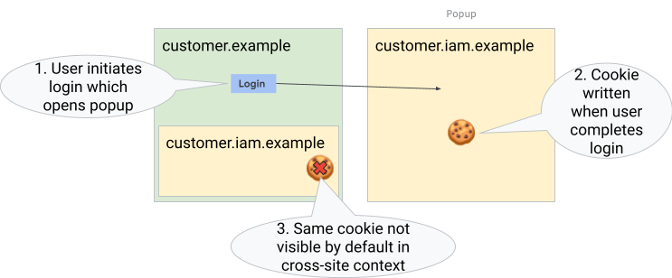

# Explainer: Partitioned Popins

* [Discussion](https://github.com/arichiv/partitioned-popins/issues)

## Introduction

A new web primitive is needed to cover short-lived popup use cases which require access to storage partitioned by the popup opener.
This primitive should be private and secure by default, while providing a consistent UI experience across user agents.

To solve this need, we propose the “Partitioned Popin”, a type of pop-up for loading web content with two unique new features: a modal-like UI relative to its opener tab and cookies/storage being partitioned to its opener context.

This ‘popin’ could be useful for any sites wanting a consistent way to prompt the user to interact with a new window in a way that makes it clear what site initiated the interaction.
Making the ‘popin’ partitioned by its opener ensures the privacy of an iframe (restricting access to first-party storage) while retaining the security of a top-level navigation (isolating the process).

## Motivation

Many smaller businesses and applications on the web currently use third-party vendors to perform or facilitate security sensitive operations such as authentication.
These third-party vendors prefer to be loaded in top-level contexts so that they are not subject to clickjacking or script injection attacks by a compromised relying party.
To obtain this behavior, login vendors typically open popups or perform redirects, which subsequently close or redirect back to the relying party, with a result token sent back via mechanisms such as cookies, postMessage, or URL parameters.

These methods are incompatible with modern browsers’ privacy and security goals for partitioning cross-site state:

* Third-party cookies are on the path to being deprecated in all major browsers, breaking any flows that would require the service to access them on the relying party’s site.
* Opener access to unpartitioned cross-site contexts provides a potential tracking vector, and browser vendors have [discussed options to restrict default opener access](https://github.com/privacycg/proposals/issues/7) in the past.
* Websites that require [crossOriginIsolation](https://developer.mozilla.org/en-US/docs/Web/API/crossOriginIsolated) [cannot currently](https://github.com/explainers-by-googlers/document-isolation-policy) open popups without severing the opener relationship, which may be required for the login (or other transaction) to complete.
* Using URL parameters for sensitive information makes sites more vulnerable to cross-site request forgery attacks.

There are also some UX challenges with this pattern:
* Popups on mobile open in new tabs, and bring users outside of the context of the main application (relying party) that they are interacting with. As a result, most vendors rely on redirects on mobile, which offer a suboptimal user experience.
* Even popups on desktop can be challenging for developers to correctly position the window and gray out the relying party, to ensure that users can easily locate the window and complete the operation.

### Examples

In the example below, popup authentication is blocked by third-party cookie deprecation.

In the example below, redirect authentication is blocked by third-party cookie deprecation.

These flows are currently partly detected and mitigated through the [cookie access heuristics](https://github.com/amaliev/3pcd-exemption-heuristics/blob/main/explainer.md) that shipped in major browsers.
The general consensus is that the web ecosystem needs to find ways to replace the heuristics with more private and secure alternatives.
We see this proposal as a major contribution to that effort.
